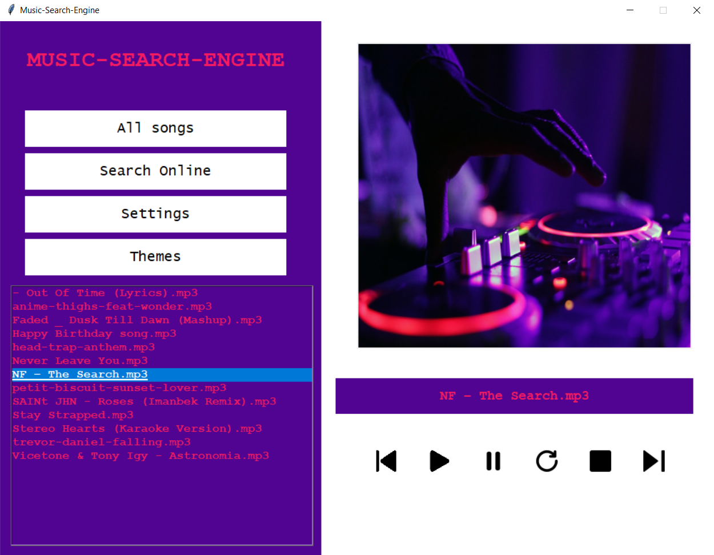
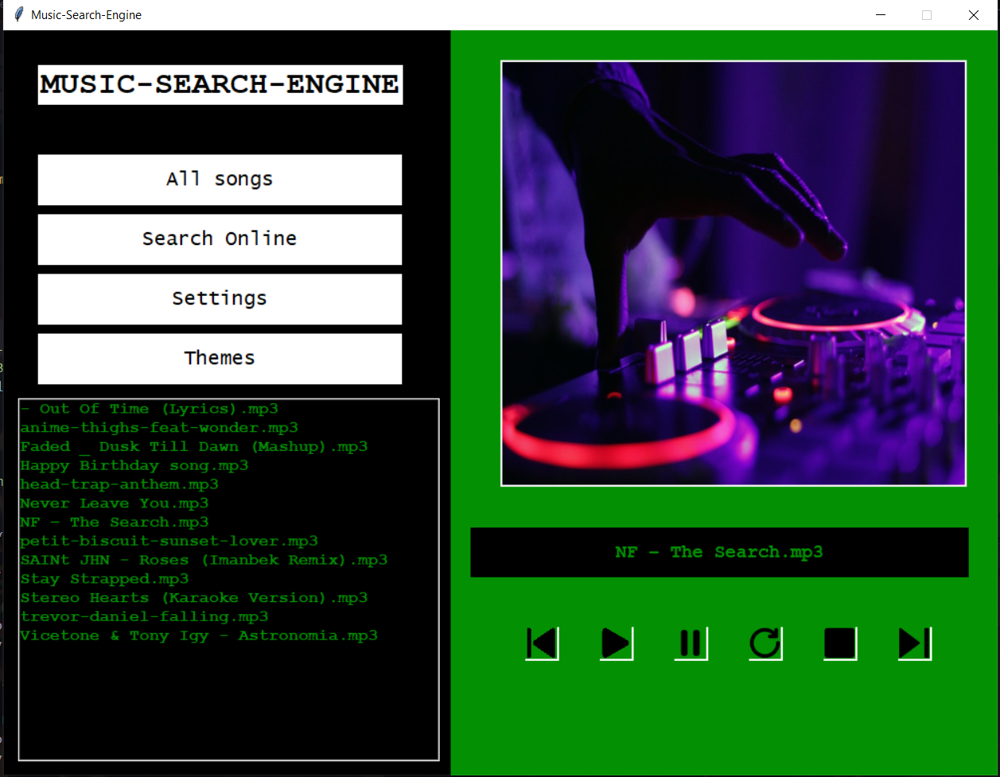

# Music-Search-Engine
For now, this is a simple music search engine built with Python and the Tkinter library. It allows you to search and play MP3 files on your computer, and change the theme of the interface.

As the name suggests, Music-Search-Engine is an app for searching and playing music (.mp3 files). The song is not currently available on your computer, but you will be able to search and listen to the song with the additional feature. This app uses SoundCloud library to fetch all songs available on SoundCloud and even download those that are available for download there. Even though this option is not available yet, I am still working on it.


## Requirements

On your desktop, create a folder named "Music". 

To run the program, you will need to install the following libraries.


### Pillow

```bash
  pip install pillow
```

### Pygame
```bash
  pip install pygame
```

### Fnmatch
```bash
  pip install fnmatch
```

## Screenshots





